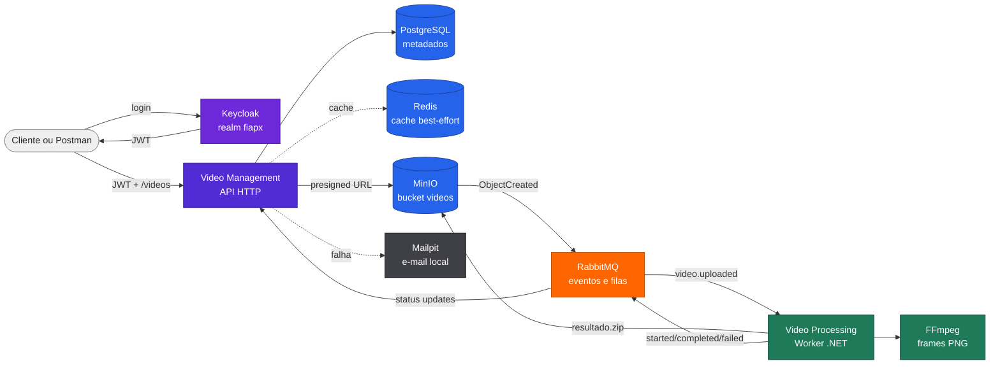

# fiap-fase5-docs

Documentação MkDocs Material da arquitetura FIAP X, responsável por publicar a visão consolidada da solução de processamento assíncrono de vídeos da Fase 5.

[]()
[](https://fabianorodrigues.github.io/fiap-fase5-docs/)
[](https://github.com/fabianorodrigues/fiap-fase5-docs/actions/workflows/docs.yml)

## Sumário

- [Visão geral](#visão-geral)
- [Documentação publicada](#documentação-publicada)
- [Solução documentada](#solução-documentada)
- [Responsabilidade deste repositório](#responsabilidade-deste-repositório)
- [Estrutura](#estrutura)
- [Execução local](#execução-local)
- [Build e validação](#build-e-validação)
- [Publicação](#publicação)
- [About do repositório](#about-do-repositório)

---

## Visão geral

Este repositório concentra a documentação publicável da solução FIAP X. Ele usa os três repositórios reais da aplicação como fonte de verdade e organiza a arquitetura em páginas objetivas sobre componentes, fluxos, dados, mensageria, operação, CI/CD e decisões arquiteturais.

| Repositório | Papel |
| --- | --- |
| [fiapx-infra](https://github.com/fabianorodrigues/fiapx-infra) | Ambiente integrado, Docker Compose, bootstrap, health, deploy e recuperação |
| [fiapx-video-management](https://github.com/fabianorodrigues/fiapx-video-management) | API HTTP, autenticação, upload, status, listagem, download e notificação de erro |
| [fiapx-video-processing](https://github.com/fabianorodrigues/fiapx-video-processing) | Worker assíncrono, RabbitMQ, MinIO, FFmpeg, ZIP e eventos de processamento |
| [fiap-fase5-docs](https://github.com/fabianorodrigues/fiap-fase5-docs) | Site de documentação, navegação, diagramas Mermaid e publicação no GitHub Pages |

**Tecnologias:** MkDocs Material, Mermaid, GitHub Pages, GitHub Actions, Docker, PostgreSQL, Redis, RabbitMQ, MinIO, Keycloak, Mailpit, .NET 10 e FFmpeg.

---

## Documentação publicada

URL pública esperada:

<https://fabianorodrigues.github.io/fiap-fase5-docs/>

O workflow `.github/workflows/docs.yml` valida o site com `mkdocs build --strict`, envia o artifact do Pages e publica pelo ambiente `github-pages`.

---

## Solução documentada



Fluxo principal:

1. O usuário autentica no Keycloak.
2. A API registra o vídeo e devolve uma URL pré-assinada de upload.
3. O cliente envia `original.mp4` ao MinIO.
4. O MinIO publica evento no RabbitMQ.
5. O Worker extrai frames com FFmpeg e gera `resultado.zip`.
6. O Worker publica eventos de status.
7. A API atualiza PostgreSQL, invalida Redis e notifica falhas via Mailpit.

---

## Responsabilidade deste repositório

| Item | Como é tratado |
| --- | --- |
| Site de documentação | `mkdocs.yml`, `docs/`, CSS e JavaScript adicional |
| Conteúdo arquitetural | Páginas focadas na implementação real da Fase 5 |
| Diagramas | Mermaid renderizado pelo Material for MkDocs |
| Publicação | GitHub Actions + Pages artifact/deploy |
| Execução local | Docker com `squidfunk/mkdocs-material:9.7.6` |

Este repositório não contém código da API, do Worker ou da infraestrutura de execução. Ele documenta esses projetos e aponta para os READMEs de cada um quando o detalhe operacional pertence ao repositório de origem.

---

## Estrutura

| Caminho | Conteúdo |
| --- | --- |
| `docs/index.md` | Página inicial da documentação |
| `docs/arquitetura/` | Visão geral, componentes, comunicação e tecnologias |
| `docs/fluxos/` | Upload, processamento, sucesso e erro |
| `docs/dados/` | Persistência, cache, MinIO e RabbitMQ |
| `docs/operacao/` | Execução local, CI/CD e validação ponta a ponta |
| `docs/decisoes/` | Decisões arquiteturais |
| `docs/stylesheets/extra.css` | Ajustes visuais do site |
| `docs/javascripts/` | Mermaid e visualizador de diagramas |
| `.github/workflows/docs.yml` | Workflow de build e publicação |

---

## Execução local

No diretório deste repositório:

```powershell
docker run --rm `
  -p 127.0.0.1:8000:8000 `
  -v "${PWD}:/docs" `
  squidfunk/mkdocs-material:9.7.6 `
  serve -a 0.0.0.0:8000
```

O site fica disponível em:

<http://127.0.0.1:8000/fiap-fase5-docs/>

---

## Build e validação

```powershell
docker run --rm `
  -v "${PWD}:/docs" `
  squidfunk/mkdocs-material:9.7.6 `
  build --strict --site-dir /tmp/fiap-fase5-docs-site
```

O build estrito valida navegação, links internos e configuração do MkDocs.

---

## Publicação

O workflow `docs.yml` executa automaticamente em:

- `push` na branch `main`;
- `workflow_dispatch`.

Configuração esperada no GitHub:

| Campo | Valor |
| --- | --- |
| Settings > Pages > Source | GitHub Actions |

Após o workflow concluir, a documentação fica disponível em:

<https://fabianorodrigues.github.io/fiap-fase5-docs/>
