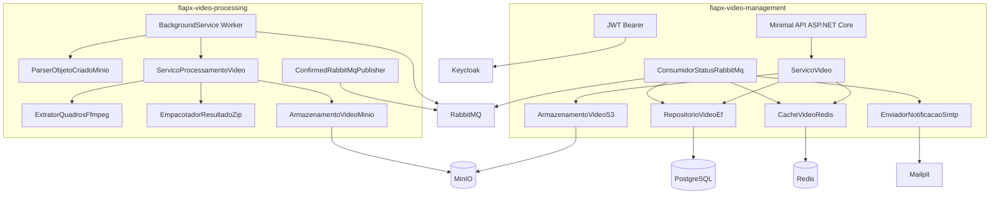

# Componentes

## Visão de componentes

## Video Management Service

Confirmado na implementação:

| Item | Implementação |
| --- | --- |
| Tipo | API HTTP ASP.NET Core Minimal APIs |
| Health | `GET /health` sem autenticação |
| Autenticação | JWT Bearer, issuer do realm `fiapx`, audience `video-management-service` |
| Identidade | `sub` vira `userId`; `email` é obrigatório |
| Endpoints de vídeo | `POST /videos`, `GET /videos`, `GET /videos/{videoId}`, `GET /videos/{videoId}/download` |
| Upload/download | URLs pré-assinadas S3/MinIO, `PUT` para upload e `GET` para download |
| Persistência | EF Core + PostgreSQL |
| Cache | Redis com TTL configurável, padrão 30 segundos |
| Eventos | Consumer RabbitMQ para status de processamento |
| Notificação | SMTP best-effort para falha de processamento |

A API não processa vídeo. Ela coordena metadados, segurança, status e URLs.

## Video Processing Service

Confirmado na implementação:

| Item | Implementação |
| --- | --- |
| Tipo | .NET Worker Service, sem API HTTP |
| Entrada | Fila `video.processing` com evento MinIO |
| Parser | Aceita `s3:ObjectCreated:Put` e `s3:ObjectCreated:CompleteMultipartUpload` |
| Chave de entrada | `videos/{userId}/{videoId}/original.mp4` |
| Processamento | FFmpeg com filtro `fps=1` |
| Frames | `frame_000001.png`, `frame_000002.png`, ... |
| Saída | `results/{userId}/{videoId}/resultado.zip` |
| Eventos | `video.processing.started`, `video.processing.completed`, `video.processing.failed` |
| Idempotência | Se o ZIP final já existir e for válido, o processamento é tratado como já concluído |

## Infra

O repositório `fiapx-infra` integra os serviços com Docker Compose:

| Serviço | Função |
| --- | --- |
| `keycloak` | Importa realm `fiapx` |
| `postgres` | Guarda tabela `videos` |
| `redis` | Cache AOF |
| `rabbitmq` | Importa topologia versionada |
| `minio` | Armazena originais e resultados |
| `minio-init` | Cria bucket e notificação AMQP |
| `mailpit` | Recebe e-mails locais |
| `video-management-migrations` | Executa migrations EF Core |
| `video-management-service` | API HTTP |
| `video-processing-service` | Worker |
