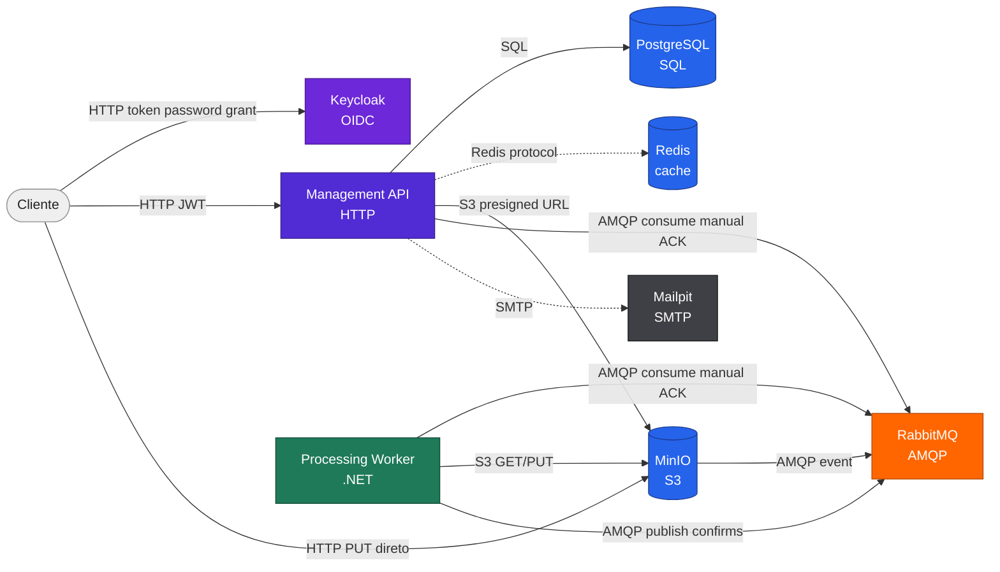

# Comunicação e Integração

## Mapa de comunicação

## Contratos HTTP

Todos os endpoints `/videos` exigem `Authorization: Bearer <access_token>`.

| Método | Rota | Resultado |
| --- | --- | --- |
| `GET` | `/health` | Health check da API |
| `POST` | `/videos` | Cria registro `RECEBIDO` e retorna `uploadUrl` |
| `GET` | `/videos` | Lista vídeos do usuário autenticado |
| `GET` | `/videos/{videoId}` | Consulta status e metadados do vídeo |
| `GET` | `/videos/{videoId}/download` | Retorna `downloadUrl` quando status é `CONCLUIDO` |

Restrições confirmadas:

- `POST /videos` aceita apenas `fileName` com extensão `.mp4`.
- `contentType` deve ser `video/mp4`.
- Download antes de `CONCLUIDO` retorna conflito.
- Vídeos inexistentes ou de outro usuário retornam `404`.

## Eventos entre serviços

| Origem | Destino | Canal | Evento |
| --- | --- | --- | --- |
| MinIO | RabbitMQ | `video.processing.exchange` | `video.uploaded` |
| RabbitMQ | Worker | `video.processing` | Notificação MinIO `ObjectCreated` |
| Worker | RabbitMQ | `video.events` | `video.processing.started` |
| Worker | RabbitMQ | `video.events` | `video.processing.completed` |
| Worker | RabbitMQ | `video.events` | `video.processing.failed` |
| RabbitMQ | API | `video.status-updates` | Eventos de status |

## Semântica

A solução opera com entrega `at-least-once`. Por isso, consumidores precisam aceitar duplicidade:

- o Worker verifica se `resultado.zip` já existe e é válido antes de processar e antes de fazer upload;
- a API trata eventos repetidos como idempotentes quando o estado já reflete o evento;
- ACK manual só ocorre após o tratamento ou publicação de retry;
- falhas terminais seguem para DLQ.
