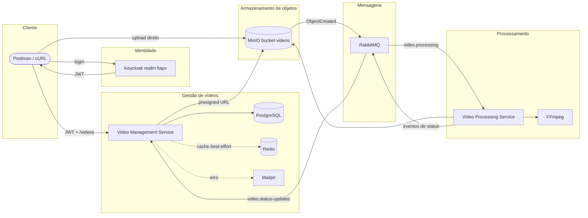

# Visão Geral

## Objetivo

A solução FIAP X processa vídeos MP4 de forma assíncrona. A API registra o vídeo e devolve uma URL temporária para upload no MinIO; o Worker processa o arquivo com FFmpeg, gera `resultado.zip` e publica eventos para que a API atualize o status.

Não há front-end na implementação atual. A interação prevista é por Postman ou cURL.

## Arquitetura em alto nível

## Responsabilidades principais

| Componente | Responsabilidade confirmada |
| --- | --- |
| Video Management Service | API HTTP, autenticação JWT, registro, status, presigned URLs, PostgreSQL, Redis, consumo de eventos e Mailpit |
| Video Processing Service | Worker sem API HTTP, consumo RabbitMQ, download/upload MinIO, FFmpeg, ZIP, retry, DLQ e idempotência |
| fiapx-infra | Ambiente integrado com Docker Compose, bootstrap de serviços e workflows de CI/CD |
| Keycloak | Realm `fiapx`, client `fiapx-postman`, audience `video-management-service` e usuários DEMO |
| PostgreSQL | Fonte de verdade dos metadados e estados dos vídeos |
| Redis | Cache best-effort de listagem e detalhe |
| MinIO | Bucket privado `videos`, upload/download por URL temporária e notificação AMQP |
| RabbitMQ | Filas duráveis quorum, retry, DLQ e eventos entre serviços |
| Mailpit | SMTP/UI local para evidenciar notificação de falha |

## Fluxo principal

1. O usuário autentica no Keycloak.
2. O cliente chama `POST /videos` com JWT.
3. A API grava o vídeo como `RECEBIDO` no PostgreSQL e gera `uploadUrl`.
4. O cliente envia `original.mp4` diretamente para o MinIO.
5. O MinIO publica `ObjectCreated` no RabbitMQ com routing key `video.uploaded`.
6. O Worker consome `video.processing`, executa FFmpeg e gera `resultado.zip`.
7. O Worker publica `video.processing.started`, `video.processing.completed` ou `video.processing.failed`.
8. A API consome `video.status-updates`, atualiza PostgreSQL, invalida Redis e, em erro, tenta notificar via SMTP/Mailpit.

## Limites da solução

O ambiente é local/demonstrativo com Docker Compose. Não foram encontrados Kubernetes, API Gateway, Kafka, Saga Pattern, service mesh ou front-end próprio na implementação atual.
