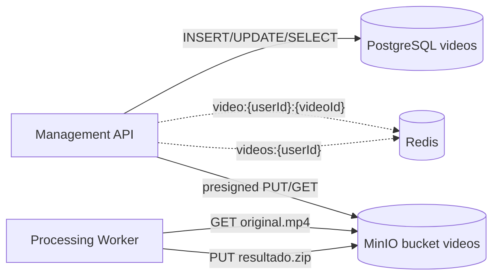

# Persistência, Cache e MinIO

## Visão de dados



## PostgreSQL

O PostgreSQL é a fonte de verdade do domínio de vídeos. A migration atual cria a tabela `videos` e uma migration posterior adiciona `error_code`.

Campos relevantes confirmados:

| Campo | Uso |
| --- | --- |
| `id` | `videoId` |
| `user_id` | Claim `sub` do JWT |
| `user_email` | Claim `email`, usado para notificação |
| `original_file_name` | Nome recebido em `POST /videos` |
| `original_object_key` | Chave do `original.mp4` |
| `result_object_key` | Chave do `resultado.zip` |
| `status` | `RECEBIDO`, `PROCESSANDO`, `CONCLUIDO`, `ERRO` |
| `error_code` | Código normalizado de falha |
| `error_message` | Mensagem sanitizada |
| `created_at` | Registro inicial |
| `processing_started_at` | Início informado por evento |
| `processing_finished_at` | Fim informado por evento |

Índice confirmado:

```sql
CREATE INDEX ix_videos_user_created
  ON videos (user_id, created_at DESC);
```

## Redis

Redis é cache degradável. Falhas de leitura, gravação ou invalidação são registradas em log e não tornam o PostgreSQL inacessível.

Chaves confirmadas:

```text
videos:{userId}
video:{userId}:{videoId}
```

TTL padrão:

```text
30 segundos
```

O cache é invalidado ao criar vídeo e ao aplicar eventos de status.

## MinIO

O bucket confirmado é:

```text
videos
```

Objetos esperados:

```text
videos/{userId}/{videoId}/original.mp4
results/{userId}/{videoId}/resultado.zip
```

O bucket é privado. A API gera URLs pré-assinadas com expiração padrão de 900 segundos. O MinIO emite evento AMQP para objetos criados sob `videos/` com sufixo `/original.mp4`.

## Idempotência no armazenamento

Antes de processar, o Worker procura `results/{userId}/{videoId}/resultado.zip`. Se o ZIP já existir e for válido, retorna o processamento como `JaProcessado`.

Antes do upload final, ele verifica novamente se outra tentativa já publicou um ZIP válido. Isso reduz risco de sobrescrever resultado válido em cenários de entrega duplicada ou concorrência.
