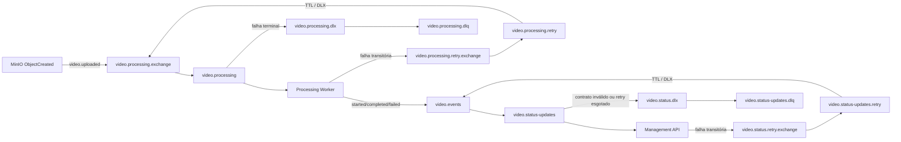

# RabbitMQ

## Topologia

## Exchanges, filas e routing keys

| Exchange | Routing key | Fila | Uso |
| --- | --- | --- | --- |
| `video.processing.exchange` | `video.uploaded` | `video.processing` | Entrada do Worker |
| `video.processing.retry.exchange` | `video.uploaded` | `video.processing.retry` | Retry de processamento |
| `video.processing.dlx` | `video.processing.dlq` | `video.processing.dlq` | Falhas terminais de processamento |
| `video.events` | `video.processing.started` | `video.status-updates` | Status `PROCESSANDO` |
| `video.events` | `video.processing.completed` | `video.status-updates` | Status `CONCLUIDO` |
| `video.events` | `video.processing.failed` | `video.status-updates` | Status `ERRO` |
| `video.status.retry.exchange` | `video.processing.*` | `video.status-updates.retry` | Retry de status |
| `video.status.dlx` | `video.status.dlq` | `video.status-updates.dlq` | DLQ de status |

As filas são duráveis e do tipo quorum no ambiente integrado.

## Garantias implementadas

| Mecanismo | Confirmação na implementação |
| --- | --- |
| Entrega `at-least-once` | Policies RabbitMQ com `dead-letter-strategy: at-least-once` |
| ACK manual | Consumers usam `autoAck: false` |
| Prefetch | Configurável por `RABBITMQ_PREFETCH`, padrão efetivo `1` |
| Mensagens persistentes | Publicações de eventos/retry usam `Persistent = true`; MinIO usa delivery mode `2` |
| Publisher confirms | Canais de publicação criados com confirmações habilitadas |
| Retry | Reenvio para exchange de retry com header de tentativa e expiração |
| DLQ | `video.processing.dlq` e `video.status-updates.dlq` |

## Observações operacionais

As filas de retry usam expiração da mensagem para atrasar a reentrega. Ao expirar, a policy envia a mensagem de volta para a exchange principal.

No Compose local existe apenas um broker RabbitMQ. Quorum queues melhoram durabilidade e semântica de dead-lettering, mas não representam alta disponibilidade real sem cluster.
