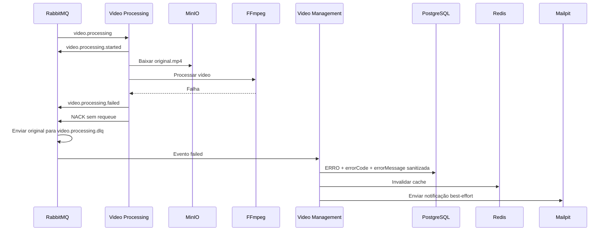

# Fluxo de Erro

## Falha de processamento



## Classificação de falhas

O Worker classifica falhas transitórias e terminais:

| Tipo | Exemplos confirmados | Tratamento |
| --- | --- | --- |
| Transitória | timeout, HTTP transitório, I/O, storage com `408`, `429` ou `>= 500` | Reenvio para retry até `PROCESSING_MAX_ATTEMPTS` |
| Terminal | comando inválido, vídeo ausente, falha FFmpeg, saída inválida, ZIP inválido, storage terminal | Evento `failed` e DLQ |

O padrão de tentativas é configurável por ambiente. No Compose atual:

```text
PROCESSING_MAX_ATTEMPTS=3
PROCESSING_RETRY_DELAY_MS=5000
STATUS_MAX_ATTEMPTS=3
STATUS_RETRY_DELAY_MS=5000
```

## Persistência do erro

A API sanitiza a mensagem de erro antes de persistir. A sanitização remove stack traces, caminhos locais e possíveis atribuições de segredo, e grava também `error_code`.

Estados de erro:

```text
RECEBIDO -> ERRO
PROCESSANDO -> ERRO
```

Eventos duplicados de falha são tratados de forma idempotente quando o vídeo já está em `ERRO`.

## Notificação

A notificação é feita pelo Management após consumir `video.processing.failed`. No ambiente local, o SMTP é o Mailpit e a validação é feita pela interface `http://localhost:8025`.

A tentativa de envio é best-effort: falha ao enviar e-mail não desfaz a atualização do status do vídeo.
