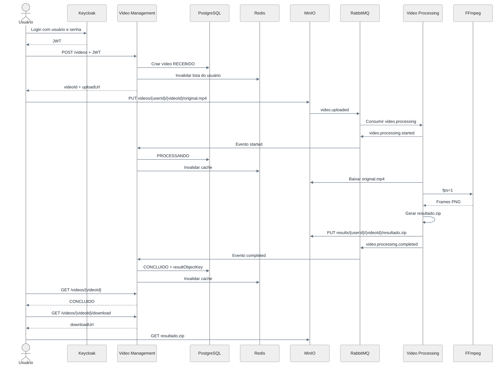

# Fluxo de Sucesso

## Sequência completa



## Estados

```text
RECEBIDO -> PROCESSANDO -> CONCLUIDO
```

O `resultObjectKey` persistido no PostgreSQL aponta para:

```text
results/{userId}/{videoId}/resultado.zip
```

## Resultado

O ZIP contém frames PNG gerados com nomes estáveis:

```text
frame_000001.png
frame_000002.png
...
```

O empacotador valida que o ZIP não está vazio, que os nomes seguem o padrão esperado e que cada entrada começa com assinatura PNG válida.
