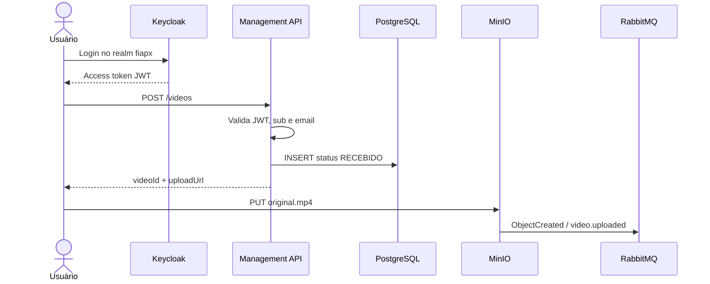
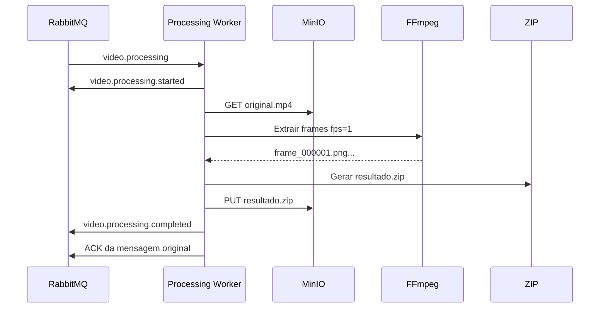

# Upload e Processamento

## Fluxo de upload



O registro e o upload são desacoplados. A API cria o metadado e a URL temporária; o arquivo é enviado diretamente ao MinIO.

## Chaves de objetos

| Objeto | Caminho confirmado |
| --- | --- |
| Vídeo original | `videos/{userId}/{videoId}/original.mp4` |
| Resultado | `results/{userId}/{videoId}/resultado.zip` |

O Worker rejeita notificações MinIO que não sigam a chave canônica do vídeo original.

## Processamento assíncrono



O Worker só confirma a mensagem original após concluir o processamento e publicar o evento de conclusão. Em falha transitória, publica a mensagem em retry e confirma a entrega original; em falha terminal, publica evento de falha e envia a mensagem original para DLQ.

## Concorrência

A escala é feita por múltiplas instâncias do `video-processing-service` consumindo a mesma fila `video.processing`.

```powershell
docker compose `
  --env-file .env `
  -f docker-compose.yml `
  -f docker-compose.dev.yml `
  up -d --build --scale video-processing-service=3
```

Como cada Worker não guarda estado local permanente, o RabbitMQ distribui as mensagens entre consumidores concorrentes.
