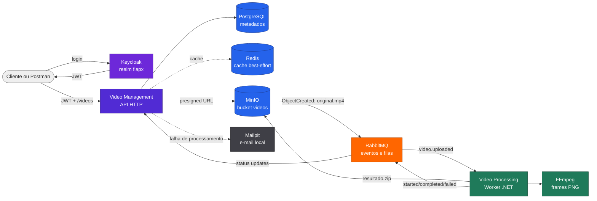
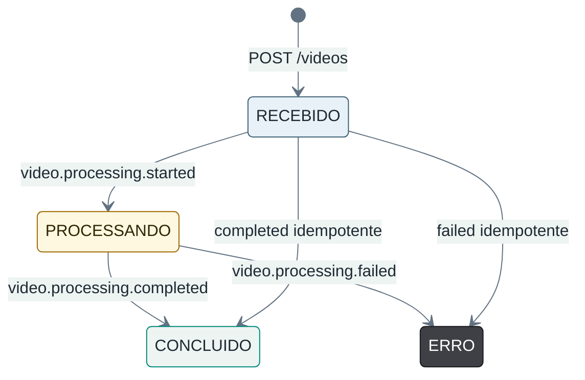

<section class="fiapx-hero" markdown="1">

FIAP X - Fase 5

# Arquitetura FIAP X

Documentação publicável da solução de processamento assíncrono de vídeos da FIAP X.
A solução permite que um usuário autenticado envie um vídeo MP4, acompanhe o status
e baixe um `resultado.zip` com frames PNG extraídos pelo FFmpeg.

  .NET 10
  Keycloak
  PostgreSQL
  Redis
  MinIO
  RabbitMQ
  FFmpeg
  Docker Compose

</section>

## Visão rápida

O FIAP X não possui front-end próprio. A jornada é executada por Postman ou cURL: o usuário autentica no Keycloak, chama a API de gestão, envia o arquivo diretamente ao MinIO por URL pré-assinada e acompanha o status até o processamento terminar.

## Repositórios

<table class="fiapx-repos">
  <thead>
    <tr>
      <th>Repositório</th>
      <th>Responsabilidade</th>
    </tr>
  </thead>
  <tbody>
    <tr>
      <td><code>fiapx-infra</code></td>
      <td>Compose integrado, PostgreSQL, Redis, RabbitMQ, MinIO, Keycloak, Mailpit, bootstrap, health checks e deploy da stack.</td>
    </tr>
    <tr>
      <td><code>fiapx-video-management</code></td>
      <td>API HTTP, JWT, registro de vídeos, URLs pré-assinadas, status, cache, download e notificação de erro.</td>
    </tr>
    <tr>
      <td><code>fiapx-video-processing</code></td>
      <td>Worker assíncrono, consumo RabbitMQ, download MinIO, FFmpeg, ZIP, upload de resultado, retry, DLQ e eventos de status.</td>
    </tr>
  </tbody>
</table>

Links:

- [fiapx-infra](https://github.com/fabianorodrigues/fiapx-infra)
- [fiapx-video-management](https://github.com/fabianorodrigues/fiapx-video-management)
- [fiapx-video-processing](https://github.com/fabianorodrigues/fiapx-video-processing)
- [fiap-fase5-docs](https://github.com/fabianorodrigues/fiap-fase5-docs)

## Caminhos de leitura

  <a class="fiapx-card" href="arquitetura/visao-geral/">
    

      <h3>Entender a arquitetura</h3>
      
Comece pela visão geral, componentes e comunicação entre serviços.

    

    Abrir arquitetura
  </a>
  <a class="fiapx-card" href="fluxos/upload-processamento/">
    

      <h3>Seguir o fluxo principal</h3>
      
Veja upload, processamento assíncrono, sucesso e erro.

    

    Abrir fluxos
  </a>
  <a class="fiapx-card" href="operacao/validacao-ponta-a-ponta/">
    

      <h3>Validar a entrega</h3>
      
Use o roteiro de demonstração e a rastreabilidade dos requisitos.

    

    Abrir validação
  </a>

## Estados do vídeo

O PostgreSQL é a fonte de verdade dos estados. O Redis é usado como cache degradável para listagem e detalhe.
