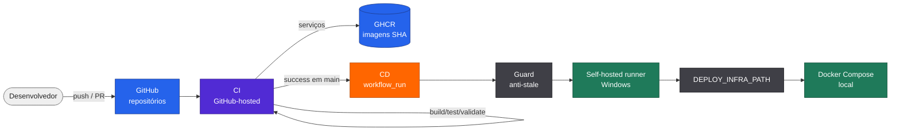

# CI/CD e Deploy

## Estratégia geral



## Repositório Infra

CI:

- roda em `ubuntu-24.04`;
- valida Compose, JSON versionado, scripts PowerShell, `.env.example`, imagens e topologia esperada.

CD:

- dispara por `workflow_run` após CI aprovado em `push` na `main`;
- usa `head_sha` do CI;
- consulta o HEAD atual da `main` para evitar deploy de commit ultrapassado;
- executa no runner self-hosted Windows com label `fiap-fase5`;
- usa `DEPLOY_INFRA_PATH` como working copy operacional;
- sobe dependências, reconcilia RabbitMQ/MinIO, roda migrations, recria Management e Processing preservando escala detectada do Worker.

## Repositórios dos serviços

CI de `fiapx-video-management` e `fiapx-video-processing`:

- restore, build e testes xUnit;
- coverage Cobertura com badge;
- build Docker;
- publicação no GHCR em `push` na `main`.

As imagens publicadas recebem tag com o SHA do commit e também `latest`. O deploy usa a tag por SHA como referência operacional.

CD dos serviços:

- dispara por `workflow_run` depois do CI aprovado;
- valida que `DEPLOY_IMAGE` termina com `DEPLOY_SHA`;
- usa lock global `Global\FiapXDeployLock`;
- atualiza apenas o serviço alvo no Compose da Infra;
- persiste `VIDEO_MANAGEMENT_IMAGE` ou `VIDEO_PROCESSING_IMAGE` no `.env` somente após validação.

## Ordem em ambiente vazio

1. `fiapx-infra`.
2. `fiapx-video-management`.
3. `fiapx-video-processing`.

A Infra cria as dependências e pode usar imagens de bootstrap quando o `.env` ainda não existe. Depois, cada serviço atualiza sua própria imagem de forma independente.

## Configuração manual necessária

Em cada repositório, configure:

```text
Settings > Secrets and variables > Actions > Variables
DEPLOY_INFRA_PATH=C:\Projetos\fiap-fase5\fiapx-infra
```

Runners esperados:

| Repositório | Runner name |
| --- | --- |
| `fiapx-infra` | `fiapx-infra-deploy` |
| `fiapx-video-management` | `fiapx-management-deploy` |
| `fiapx-video-processing` | `fiapx-processing-deploy` |

Labels:

```text
self-hosted
Windows
X64
fiap-fase5
```

Tokens, PATs e secrets reais não devem ser documentados nem versionados.
