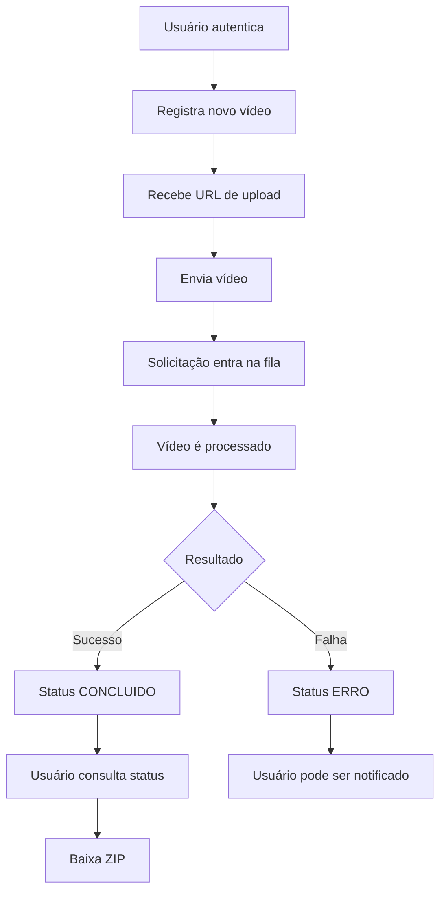

# FIAP X — Fluxo de Negócio

## 1. Visão do domínio

A FIAP X oferece um serviço de processamento de vídeos.

O usuário envia um vídeo e não precisa permanecer conectado aguardando o processamento. O sistema recebe o arquivo, executa o processamento em segundo plano, extrai imagens do conteúdo e gera um pacote ZIP.

Enquanto o processamento acontece, o usuário pode consultar seus vídeos e acompanhar o estado de cada solicitação.

Quando o processamento termina, o resultado fica disponível para download.

Se houver falha, o processamento é identificado como erro e o usuário pode ser notificado.

---

# 2. Fluxo principal

## Etapa 1 — Acesso

O usuário autentica no sistema com usuário e senha.

Após a autenticação, recebe uma credencial que identifica sua sessão.

Somente usuários autenticados podem utilizar as funcionalidades de vídeos.

---

## Etapa 2 — Registro de um vídeo

O usuário informa que deseja enviar um novo vídeo.

O sistema:

1. cria um identificador único para o vídeo;
2. associa o vídeo ao usuário autenticado;
3. registra o vídeo;
4. atribui o status `RECEBIDO`;
5. disponibiliza um endereço temporário para envio do arquivo.

---

## Etapa 3 — Envio

O usuário envia o arquivo de vídeo.

O envio do arquivo não executa o processamento de forma síncrona.

Após o vídeo estar disponível, uma solicitação de processamento é colocada na fila.

Isso permite que o sistema aceite novos vídeos mesmo quando todos os processadores estiverem ocupados.

---

## Etapa 4 — Processamento

Quando houver capacidade disponível, um processador retira uma solicitação da fila.

O vídeo passa para:

```text
PROCESSANDO
```

O processador:

1. obtém o vídeo;
2. extrai as imagens;
3. cria o ZIP;
4. armazena o resultado.

Vídeos distintos podem ser processados simultaneamente.

---

## Etapa 5 — Conclusão

Quando todas as imagens forem extraídas e o ZIP estiver armazenado:

```text
Status = CONCLUIDO
```

O sistema registra a localização do resultado.

A partir desse momento o usuário pode solicitar o download.

---

## Etapa 6 — Consulta

A qualquer momento, o usuário autenticado pode consultar seus vídeos.

A listagem apresenta, no mínimo:

- identificador;
- nome original;
- status;
- data de envio;
- data de conclusão, quando aplicável.

Um usuário nunca visualiza vídeos pertencentes a outro usuário.

---

## Etapa 7 — Download

Para um vídeo concluído, o usuário solicita o download.

O sistema valida:

1. que o vídeo existe;
2. que pertence ao usuário;
3. que está concluído.

Se todas as regras forem atendidas, disponibiliza temporariamente o ZIP.

---

# 3. Fluxo de exceção

Se o processamento falhar:

1. o vídeo passa para `ERRO`;
2. a causa é registrada;
3. o erro é registrado nos logs;
4. o usuário pode receber uma notificação;
5. a mensagem poderá ser tentada novamente conforme a política da fila.

Se o limite de tentativas for atingido, a mensagem poderá ser direcionada para uma fila de mensagens não processadas (DLQ).

---

# 4. Concorrência

O processamento não pertence à mesma execução responsável por receber as solicitações do usuário.

Exemplo:

```text
Fila
 │
 ├── Vídeo A → Processor 1
 ├── Vídeo B → Processor 2
 └── Vídeo C → aguardando capacidade
```

Quando um processador termina, o próximo vídeo pendente pode ser atendido.

Dessa forma:

- mais de um vídeo pode ser processado ao mesmo tempo;
- picos são absorvidos pela fila;
- a API continua disponível independentemente da duração do processamento.

---

# 5. Jornada resumida


