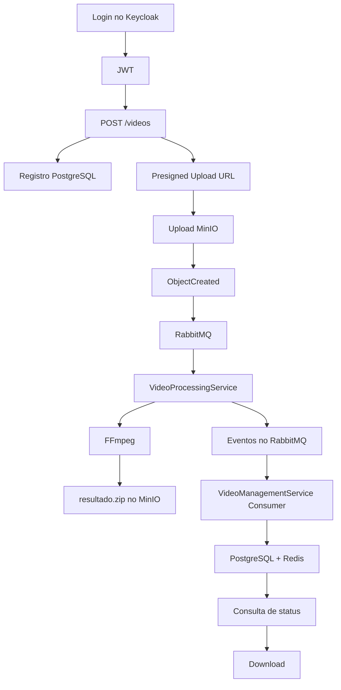

# FIAP X — Fluxo de Negócio

## 1. Autenticação
1. O usuário autentica no Keycloak com usuário e senha.
2. O Keycloak retorna um JWT.
3. O cliente envia o JWT para a VideoManagementService.
4. A VideoManagementService utiliza o claim `sub` como identidade do usuário.

## 2. Registro e upload
1. O usuário solicita o envio de um novo vídeo.
2. A VideoManagementService cria um `videoId`.
3. Associa o vídeo ao usuário autenticado.
4. Persiste o registro no PostgreSQL com status `RECEBIDO`.
5. Gera uma URL temporária de upload para o MinIO.
6. O usuário envia o vídeo diretamente para o MinIO.

Padrão:

```text
videos/{userId}/{videoId}/original.mp4
```

## 3. Enfileiramento
Após o objeto ser criado:

```text
MinIO
  |
  | ObjectCreated
  v
RabbitMQ
```

A mensagem permanece na fila até que um VideoProcessingService esteja disponível.

## 4. Processamento
1. Uma instância do VideoProcessingService recebe a mensagem.
2. Publica `VideoProcessingStarted`.
3. A VideoManagementService consome o evento e atualiza `PROCESSANDO`.
4. O Processor baixa o vídeo.
5. Executa FFmpeg.
6. Extrai as imagens.
7. Cria `resultado.zip`.
8. Salva o resultado no MinIO.

Resultado:

```text
results/{userId}/{videoId}/resultado.zip
```

## 5. Conclusão
1. Processor publica `VideoProcessingCompleted`.
2. VideoManagementService consome o evento.
3. Atualiza PostgreSQL para `CONCLUIDO`.
4. Salva `result_object_key`.
5. Invalida o Redis.

## 6. Falha
1. Processor publica `VideoProcessingFailed`.
2. VideoManagementService atualiza para `ERRO`.
3. Persiste mensagem sanitizada.
4. Invalida cache.
5. Envia e-mail via Mailpit.
6. A mensagem de processamento segue retry/DLQ.

## 7. Consulta
```text
GET /videos
GET /videos/{videoId}
```

Estratégia:

```text
Redis -> hit -> resposta
Redis -> miss -> PostgreSQL -> Redis -> resposta
```

## 8. Download
1. Usuário solicita download.
2. API valida propriedade.
3. API valida `status == CONCLUIDO`.
4. API gera URL temporária do MinIO.
5. Cliente baixa o ZIP diretamente.

## 9. Fluxo completo


