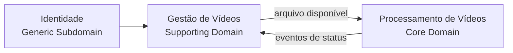

# FIAP X — Linguagem Ubíqua e Domínio

## 1. Linguagem ubíqua

| Termo | Definição |
|---|---|
| Usuário | Pessoa autenticada que envia e acompanha vídeos. |
| Vídeo | Conteúdo submetido para processamento. |
| Vídeo Original | Arquivo enviado antes do processamento. |
| VideoId | Identificador único de um vídeo. |
| Processamento de Vídeo | Execução responsável pela extração das imagens e geração do resultado. |
| Imagem Extraída | PNG produzido a partir do vídeo. |
| Resultado | ZIP final produzido pelo processamento. |
| Status | Estado atual do vídeo. |
| Recebido | Vídeo registrado para processamento. |
| Processando | Vídeo atualmente sendo processado. |
| Concluído | Resultado disponível para download. |
| Erro | Processamento finalizado sem sucesso. |
| Notificação de Erro | Comunicação enviada ao usuário após falha. |

## 2. Bounded Context — Gestão de Vídeos

### Classificação
Supporting Domain.

### Responsabilidade
- registro;
- propriedade;
- status;
- consulta;
- download;
- cache;
- notificação ao usuário.

### Implementação
`VideoManagementService`

## 3. Bounded Context — Processamento de Vídeos

### Classificação
Core Domain.

### Responsabilidade
- consumo de processamento;
- extração de imagens;
- geração do ZIP;
- armazenamento do resultado;
- publicação do resultado do processamento.

### Implementação
`VideoProcessingService`

## 4. Generic Subdomain — Identidade

Responsável por:
- usuário;
- senha;
- autenticação;
- JWT.

Implementação: `Keycloak`

## 5. Relação estratégica

## 6. Infraestrutura

Não são bounded contexts:
- PostgreSQL;
- Redis;
- RabbitMQ;
- MinIO;
- Mailpit;
- Docker Compose.
