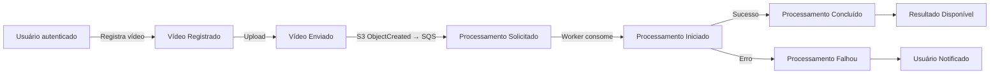
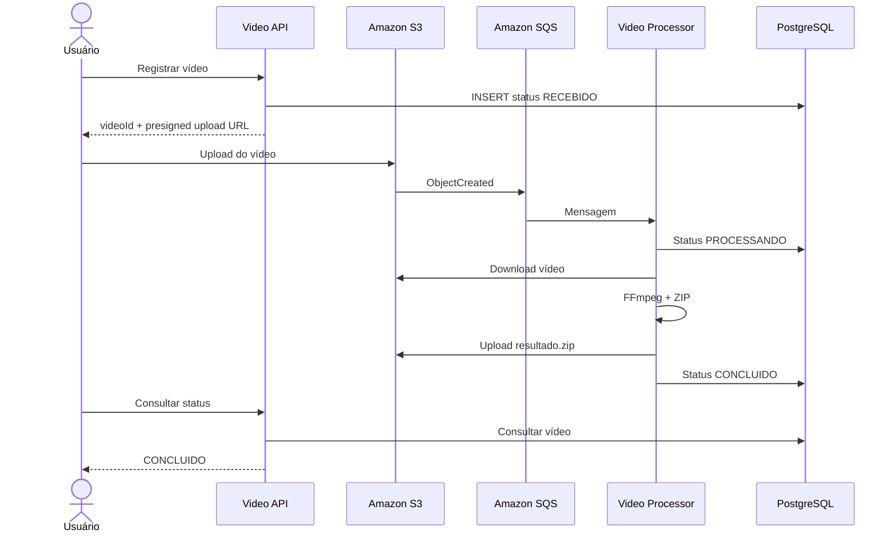
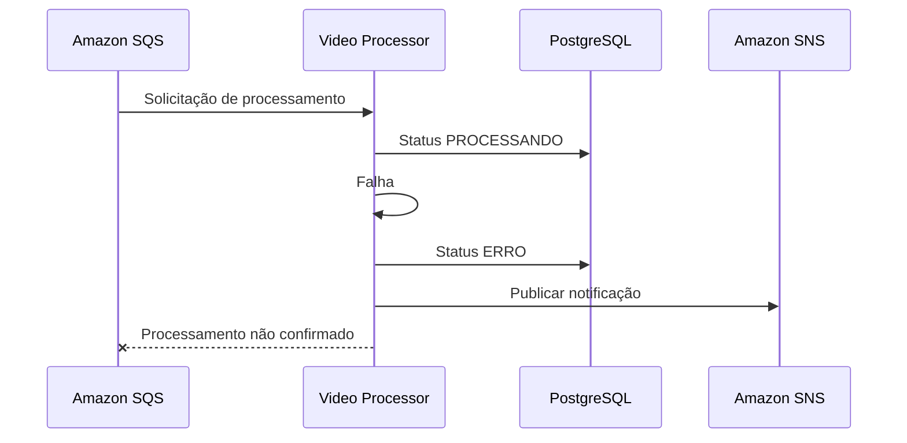

# FIAP X — Diagrama de Eventos do Sistema

## 1. Objetivo

Representar os principais acontecimentos do fluxo, sem transformar toda alteração interna em evento de integração.

---

# 2. Fluxo de eventos



---

# 3. Eventos de negócio

## Vídeo Registrado

O sistema criou um `VideoId`, associou o vídeo ao usuário e definiu:

```text
Status = RECEBIDO
```

## Processamento Iniciado

O Video Processor assumiu o processamento.

```text
Status = PROCESSANDO
```

## Processamento Concluído

O ZIP foi criado e armazenado.

```text
Status = CONCLUIDO
```

## Processamento Falhou

A execução não conseguiu produzir o resultado.

```text
Status = ERRO
```

## Resultado Disponível

O vídeo possui um `resultObjectKey` válido e pode ser baixado.

---

# 4. Evento técnico de integração

A comunicação assíncrona principal será:

```text
S3 ObjectCreated
       ↓
      SQS
       ↓
Video Processor
```

Não será criado um Event Bus genérico.

O evento nativo do S3 é suficiente para sinalizar que existe um vídeo pronto para processamento.

---

# 5. Fluxo de sucesso



---

# 6. Fluxo de falha



A SQS poderá realizar nova tentativa.

Após atingir o limite definido, a mensagem será enviada para DLQ.
