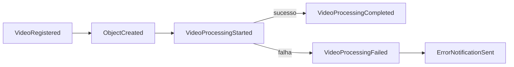
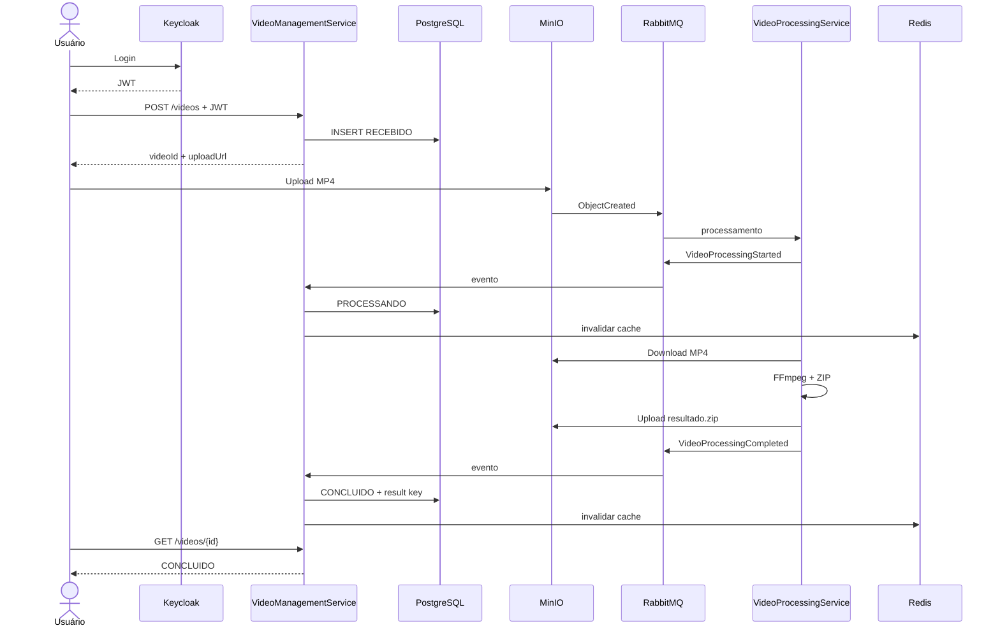
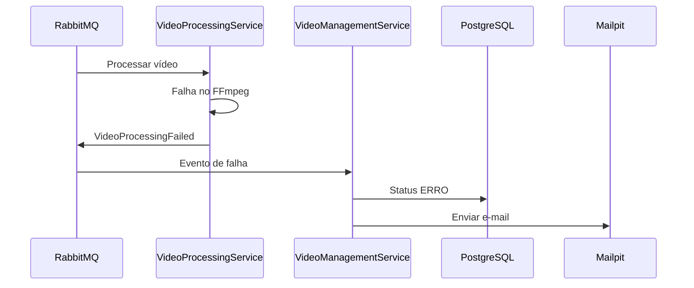

# FIAP X — Diagrama de Eventos

## 1. Eventos principais

## 2. Sequência de sucesso

## 3. Sequência de falha

## 4. Semântica

A solução assume entrega `at-least-once`.

Consequência:
- mensagens podem ser repetidas;
- consumidores devem ser idempotentes.
