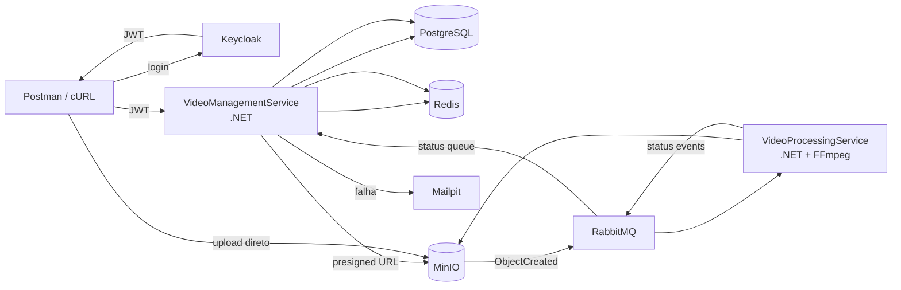

# FIAP X — Arquitetura Docker Compose

## 1. Diagrama geral



## 2. Containers

```text
fiapx-video-management-service
fiapx-video-processing-service
fiapx-keycloak
fiapx-postgres
fiapx-redis
fiapx-minio
fiapx-rabbitmq
fiapx-mailpit
```

## 3. Escalabilidade

```bash
docker compose up -d --scale video-processing-service=3
```

RabbitMQ distribui mensagens entre os consumidores:

```text
RabbitMQ
   |
   +--> Processor 1 -> Video A
   +--> Processor 2 -> Video B
   +--> Processor 3 -> Video C
```

## 4. Picos

Se houver mais vídeos que workers, as mensagens aguardam no RabbitMQ.

Garantias mínimas:
- queue durable;
- mensagens persistentes;
- manual ack;
- retry;
- dead-letter queue.

## 5. Observação

Docker Compose é utilizado para desenvolvimento e demonstração, não como plataforma de alta disponibilidade de produção.

O requisito acadêmico de escalabilidade é atendido pelo desenho stateless dos processors e pela possibilidade de aumentar consumidores.

## 6. Estrutura sugerida

```text
/
├── src/
│   ├── VideoManagementService/
│   └── VideoProcessingService/
├── tests/
│   ├── VideoManagementService.Tests/
│   └── VideoProcessingService.Tests/
├── database/
│   └── migrations/
├── docs/
├── postman/
├── docker-compose.yml
└── .github/
    └── workflows/
```
