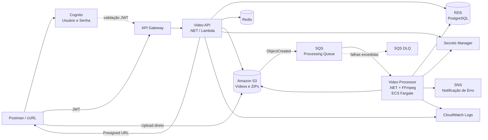

# FIAP X — Arquitetura Sugerida

## 1. Objetivo

Atender aos requisitos obrigatórios utilizando uma arquitetura pequena, demonstrável e compatível com uma entrega acadêmica no AWS Academy.

---

# 2. Diagrama geral



---

# 3. Fluxo resumido

```text
Postman
   |
   v
Cognito
   |
   v
API Gateway
   |
   v
Video API
 |    |    |
 |    |    +---- Redis
 |    +--------- PostgreSQL
 |
 +-------------- S3
                   |
                   v
                  SQS
                   |
                   v
             Video Processor
               |       |
               v       v
              S3    PostgreSQL
                       |
                     erro
                       |
                       v
                      SNS
```

---

# 4. Responsabilidade dos componentes

## Amazon Cognito

Atende:

```text
Sistema protegido por usuário e senha
```

Responsabilidades:

- usuários;
- senha;
- autenticação;
- emissão de JWT.

---

## API Gateway

Ponto de entrada HTTP.

Responsabilidades:

- expor API;
- integrar com Lambda;
- validar token do Cognito.

---

## Video API

Componente .NET responsável pela interação do usuário.

Endpoints:

```text
POST /videos
GET  /videos
GET  /videos/{videoId}
GET  /videos/{videoId}/download
```

---

## Amazon S3

Armazena:

```text
videos/{userId}/{videoId}/original.mp4
results/{userId}/{videoId}/resultado.zip
```

O bucket permanece privado.

Upload/download são feitos por URL pré-assinada.

---

## Amazon SQS

É o principal componente para atender:

```text
Em caso de picos, o sistema não deve perder uma requisição.
```

Quando o Processor estiver ocupado, as mensagens permanecem na fila.

---

## DLQ

Recebe mensagens que excederam o limite de tentativas.

É uma proteção adicional para evitar descarte silencioso de falhas.

---

## Video Processor

Aplicação .NET Worker executada em container.

Responsabilidades:

```text
consumir SQS
↓
baixar vídeo
↓
executar FFmpeg
↓
gerar imagens
↓
criar ZIP
↓
salvar S3
↓
atualizar status
```

---

## ECS Fargate

Hospeda o Video Processor.

A arquitetura permite executar:

```text
Processor 1
Processor 2
Processor 3
...
```

Todos consumindo a mesma fila.

Isso atende ao requisito:

```text
processar mais de um vídeo ao mesmo tempo
```

Para a demonstração acadêmica, duas tasks já são suficientes para comprovar concorrência.

Não é obrigatório implementar autoscaling automático para comprovar que a arquitetura permite escalar.

---

## PostgreSQL

Fonte de verdade do estado da aplicação.

Tabela principal:

```sql
CREATE TABLE videos (
    id UUID PRIMARY KEY,
    user_id VARCHAR(100) NOT NULL,
    original_file_name VARCHAR(255) NOT NULL,
    original_object_key VARCHAR(500) NOT NULL,
    result_object_key VARCHAR(500),
    status VARCHAR(30) NOT NULL,
    error_message VARCHAR(1000),
    created_at TIMESTAMP NOT NULL,
    processing_started_at TIMESTAMP,
    processing_finished_at TIMESTAMP
);

CREATE INDEX ix_videos_user_created
    ON videos (user_id, created_at DESC);
```

---

## Redis

Cache para:

```text
GET /videos
GET /videos/{videoId}
```

Estratégia:

```text
Cache Aside
```

Exemplo:

```text
API
 |
 v
Redis
 | hit → resposta
 |
 miss
 |
 v
PostgreSQL
 |
 v
Redis
```

TTL sugerido:

```text
30 segundos
```

Falha do Redis não deve impedir consulta ao PostgreSQL.

---

## Secrets Manager

Armazena credenciais do PostgreSQL.

Nenhuma senha deverá estar versionada no GitHub.

---

## SNS

Usado quando:

```text
Processamento = ERRO
```

Uma assinatura por e-mail é suficiente para a demonstração.

---

## CloudWatch

Logs mínimos:

- `videoId`;
- início do processamento;
- conclusão;
- erro;
- duração.

Não serão adicionadas ferramentas extras de observabilidade nesta versão.

---

# 5. Escalabilidade

## API

A Lambda permite múltiplas execuções concorrentes.

## Processamento

```text
                SQS
                 |
        +--------+--------+
        |        |        |
        v        v        v
    Worker 1  Worker 2  Worker N
```

O aumento da quantidade de workers aumenta a capacidade de processamento sem alterar API, banco ou contratos.

---

# 6. Resiliência

O fluxo utiliza:

```text
SQS
Retry
DLQ
Idempotência
Persistência de status
```

A fila separa a velocidade de entrada da capacidade de processamento.

---

# 7. CI/CD

Dois pipelines podem ser utilizados.

## Video API

```text
GitHub
 ↓
GitHub Actions
 ↓
Build
 ↓
Testes
 ↓
Package
 ↓
Lambda
```

## Video Processor

```text
GitHub
 ↓
GitHub Actions
 ↓
Build
 ↓
Testes
 ↓
Docker Build
 ↓
ECR
 ↓
ECS
```

---

# 8. Testes

## Video API

Testar:

- geração de vídeo;
- segurança por usuário;
- listagem;
- consulta;
- download somente quando concluído;
- cache hit/miss;
- fallback sem Redis.

## Video Processor

Testar:

- leitura da mensagem;
- processamento;
- criação de ZIP;
- estados;
- idempotência;
- falhas.

## Integração

Demonstrar:

```text
Upload
→ SQS
→ Processor
→ ZIP
→ CONCLUIDO
→ Download
```

---

# 9. Por que esta arquitetura

Ela atende aos requisitos sem introduzir componentes desnecessários.

Demonstra:

- microsserviços/componentes independentes;
- API;
- autenticação;
- mensageria;
- processamento assíncrono;
- cache;
- persistência;
- containers;
- escalabilidade;
- segurança;
- CI/CD;
- cloud.

Ao mesmo tempo, evita Kubernetes, Kafka, Saga e outros componentes que aumentariam o esforço sem serem necessários para o problema proposto.
